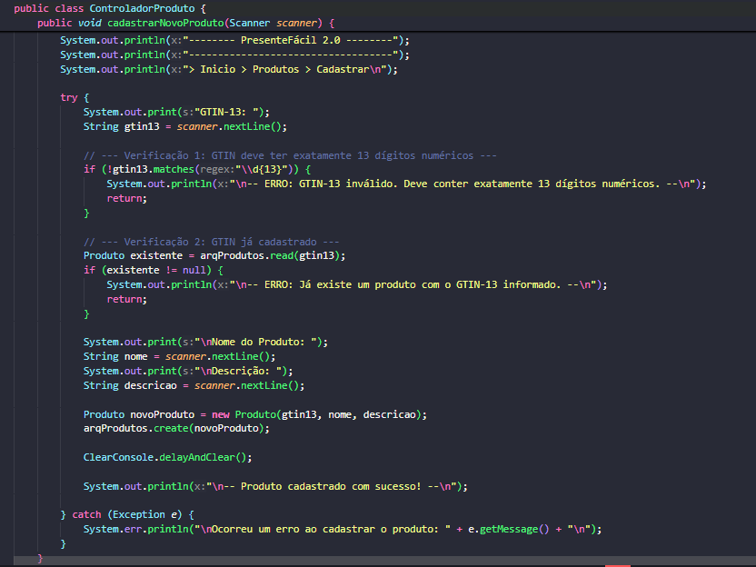
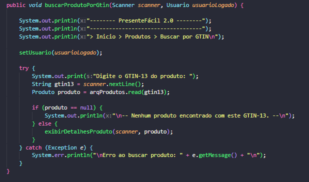
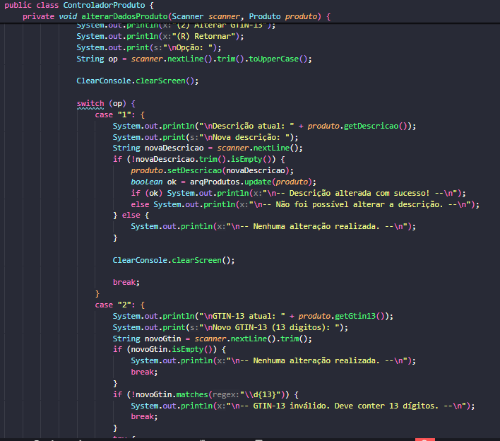
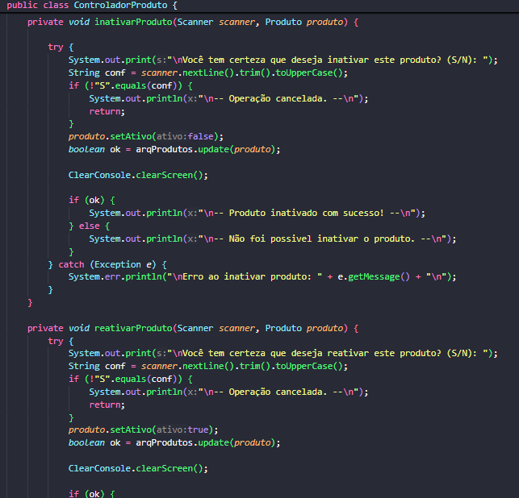
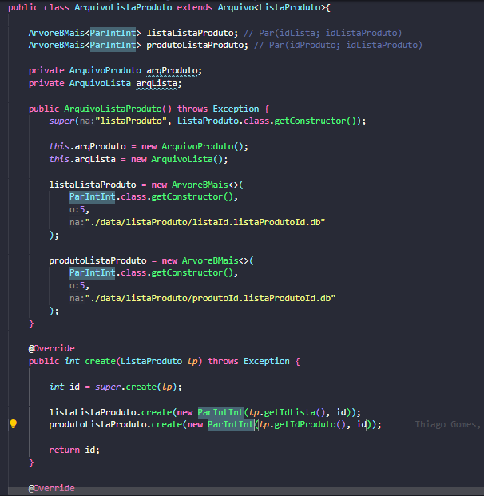
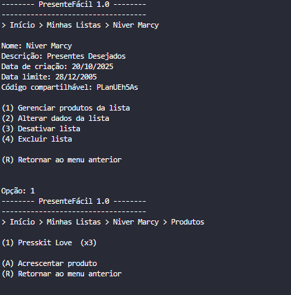
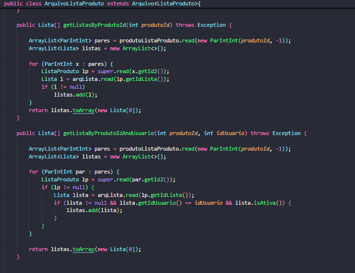
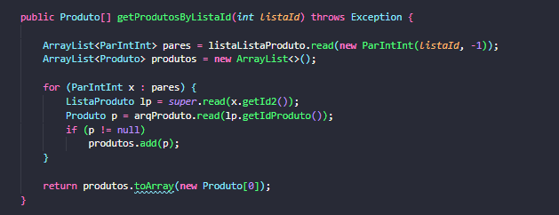
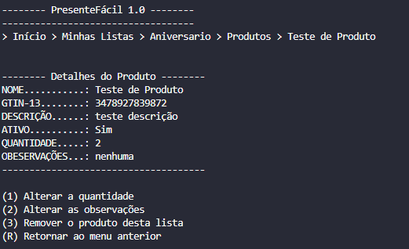
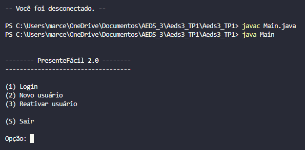

  

<h1 align="center">PONTIFÍCIA UNIVERSIDADE CATÓLICA DE MINAS GERAIS</h1>
<h3 align="center">Instituto de Ciências Exatas e de Informática</h3>
<h3 align="center">Curso de Ciência da Computação</h3>

 

# Relatório Trabalho Prático 02

## Algoritmos e Estruturas de Dados III

Este relatório descreve a segunda parte do Trabalho Prático da disciplina de AEDS III.

 

### Autores

  * **Bernardo Ladeira Kartabil**
       \* `bernardo.kartabil@sga.pucminas.br`
  * **Marcella Santos Belchior**
      \* `marcella.belchior@sga.pucminas.br`
  * **Thiago Henrique Gomes Feliciano**
      \* `1543790@sga.pucminas.br`
  * **Yasmin Torres Moreira dos Santos**
      \* `yasmin.santos.1484596@sga.pucminas.br`

-----

### **Resumo**

Este trabalho é a segunda fase de evolução do "PresenteFácil", um sistema de gerenciamento de listas de presentes em Java, desenvolvido para a disciplina de Algoritmos e Estruturas de Dados III.

O foco principal foi implementar um relacionamento N:N  entre as entidades Lista e Produto. Para isso, o sistema agora oferece operações CRUD completas para Produtos e para a nova entidade de associação, ListaProduto.

Para garantir um acesso eficiente aos dados, utilizamos estruturas de indexação externas:

Hash Extensível: Usada para criar índices diretos e indiretos.

Árvore B+: Empregada para materializar e otimizar o relacionamento N:N, acelerando consultas cruciais como "quais produtos estão nesta lista?" e "em quais listas este produto aparece?".

A arquitetura geral do sistema segue o padrão Model-View-Controller (MVC) e utiliza uma classe base ArquivoIndexado para gerenciar a persistência em arquivos.

**Palavras-chave:** Java, Estrutura de Dados, Hash Extensível, Árvore B+, CRUD, N:N, Persistência de Dados.

-----

## Sumário

1.  [INTRODUÇÃO]
2.  [CHECKLIST DE REQUISITOS]
      * [2.1 CRUD de produtos]
      * [2.2 CRUD de ListaProduto]
      * [2.3 Visão de produtos]
      * [2.4 Visão de listas]
      * [2.5 Integridade do relacionamento]
      * [2.6 Compila corretamente]
      * [2.7 Completo e funcionando]
      * [2.8 Originalidade do trabalho]
4.  [CONCLUSÃO]

-----

## 1\. INTRODUÇÃO

O principal objetivo deste trabalho foi desenvolver um sistema totalmente funcional que dispensasse o uso de um banco de dados tradicional.

Toda a persistência de dados foi implementada diretamente em arquivos binários. Para isso, usamos classes customizadas (ArquivoIndexado) responsáveis por gerenciar a alocação de espaço, o controle de registros de tamanhos variáveis e a reutilização de espaços livres.

A performance de operações cruciais (busca, inserção e remoção) é garantida pelo uso de arquivos de índice:

Hash Extensível: Usado para chaves primárias e secundárias (únicas).

Árvore B+: Essencial para materializar eficientemente os relacionamentos N:N.

## 2\. CHECKLIST DE REQUISITOS

A seguir, são apresentadas as respostas ao checklist proposto para a avaliação do trabalho, com cada item detalhado em uma subseção para maior clareza.

### 2.1 Há um CRUD de produtos (que estende a classe ArquivoIndexado, acrescentando Tabelas Hash Extensíveis e Árvores B+ como índices diretos e indiretos conforme necessidade) que funciona corretamente?

**Sim.** A classe `ArquivoProduto`, que herda da classe genérica `ArquivoIndexado`, é a responsável por gerenciar a persistência e indexação dos produtos.

Sua estrutura inclui um índice indireto, uma `HashExtensivel`, para mapear um identificador textual único do produto ao seu ID numérico interno. O construtor inicializa este índice e o método `create` é sobrescrito para garantir que, ao criar um produto, seu GTIN e ID sejam devidamente registrados no índice.

 

  
   
  <b>Figura 1:</b> <i>Evidência em Código: Método cadastrarNovoProduto em ControladorProduto.java - Implementa o 'Create' do CRUD. A lógica de controle é responsável por receber os dados do usuário, validar o GTIN (verificando o formato e a duplicidade através de arqProdutos.read) e, por fim, invocar arqProdutos.create para persistir o novo produto. Fonte: Elaborado pelos autores.</i>

 

  
   
  <b>Figura 2:</b> <i> Evidência em Código: Método buscarProdutoPorGtin. Este método implementa a operação 'Read' do CRUD. Ele solicita o GTIN-13 ao usuário e invoca arqProdutos.read(gtin13). Esta chamada, por sua vez, utiliza o índice Hash Extensível (mapeando GTIN -> ID) para localizar o produto de forma eficiente, sem a necessidade de varrer o arquivo principal. Fonte: Elaborado pelos autores.</i>

 

  
   
  <b>Figura 3:</b> <i>Evidência em Código: Método alterarDadosProduto. Este método implementa a operação 'Update' do CRUD. Ele permite ao usuário modificar os dados de um produto (como descrição ou GTIN). Ao final, ele invoca arqProdutos.update(produto). A camada de persistência (ArquivoProduto) é responsável por sobrescrever o registro no arquivo e, crucialmente, atualizar o índice Hash Extensível caso a chave (GTIN-13) tenha sido alterada, garantindo a integridade do índice. Fonte: Elaborado pelos autores.</i>

 

  
   
  <b>Figura 4:</b> <i>Evidência em Código: Método inativarProduto. Este método implementa a operação 'Delete' (lógica) do CRUD, conforme especificado nos requisitos do trabalho. Em vez de uma exclusão física, o produto é marcado como inativo (produto.setAtivo(false)). Em seguida, o método arqProdutos.update(produto) é chamado para persistir essa alteração de estado no arquivo, ocultando o produto de listagens futuras, mas mantendo a integridade referencial para listas antigas. Fonte: Elaborado pelos autores.</i>

 

### 2.2 Há um CRUD da entidade de associação ListaProduto (que estende a classe ArquivoIndexado, acrescentando Tabelas Hash Extensíveis e Árvores B+ como índices diretos e indiretos conforme necessidade) que funciona corretamente?

**Sim.** A classe `ArquivoListaProduto` estende `ArquivoIndexado` e implementa todas as operações de CRUD para a entidade associativa `ListaProduto`, que armazena `(idLista, idProduto, quantidade)`.

Esta classe é o cerne do relacionamento N:N e, portanto, contém os índices mais importantes: duas Árvores B+ para materializar o relacionamento em ambas as direções.

 

  
   
  <b>Figura 5:</b> <i>Evidência em Código: Índices (Árvores B+) em `ArquivoListaProduto.java`. Fonte: Elaborado pelos autores.</i>

 

A prova de execução abaixo demonstra a funcionalidade de adicionar um produto (previamente cadastrado) a uma lista de presentes existente.

 

  
   
  <b>Figura 6:</b> <i>Prova de Execução: Tela de adição de produto a uma lista. Fonte: Elaborado pelos autores.</i>

 

### 2.3 A visão de produtos está corretamente implementada e permite consultas as listas em que o produto aparece (apenas quantidade no caso de lista de outras pessoas)?

**Sim.** Para implementar esta funcionalidade, utilizamos uma das Árvores B+ da classe `ArquivoListaProduto`. Esta árvore armazena pares `(idProduto, idListaProduto)`.

Ao consultar um produto, o sistema busca na árvore B+ por todas as entradas com o `idProduto` correspondente. Isso retorna uma lista de IDs da entidade `ListaProduto`, que são então lidos para se descobrir em quais listas (`idLista`) o produto está e com qual quantidade. O sistema então aplica a regra de negócio de mostrar ou não os detalhes da lista.

 

   idListaProduto)" width="600">
   
  <b>Figura 7:</b> <i>Evidência em Código: Uso da Árvore B+ (`produtoListaProduto`) no método `getListasByProdutoId` em `ArquivoListaProduto.java` para implementar a visão Produto -> Listas. Fonte: Elaborado pelos autores.</i>

 

A prova de execução abaixo demonstra a tela de detalhes de um produto, listando as listas do usuário onde ele está presente e a contagem de listas de outros usuários.

 

  
   
  <b>Figura 8:</b> <i>Prova de Execução: Tela de visualização de produto, listando as listas onde ele aparece (diferenciando listas do usuário e de outros). Fonte: Elaborado pelos autores.</i>

 

### 2.4 A visão de listas funciona corretamente e permite a gestão dos produtos na lista?

**Sim.** Esta funcionalidade é a "outra ponta" do relacionamento N:N e é implementada de forma análoga à anterior. A classe `ArquivoListaProduto` utiliza uma segunda Árvore B+ que armazena pares `(idLista, idListaProduto)`.

Quando um usuário seleciona "Gerenciar Lista", o sistema consulta esta árvore B+ usando o `idLista` e obtém todos os registros `ListaProduto` associados. A partir desses registros, o sistema recupera os `idProduto` correspondentes, busca os dados de cada produto em `ArquivoProduto` e exibe a lista completa de produtos e suas quantidades para o usuário, permitindo a edição e remoção.

 

   idListaProduto)" width="600">
   
  <b>Figura 9:</b> <i>Evidência em Código: Uso da Árvore B+ (`listaListaProduto`) no método `getProdutosByListaId` em `ArquivoListaProduto.java` para implementar a visão Lista -> Produtos. Fonte: Elaborado pelos autores.</i>

 

A prova de execução abaixo demonstra o menu de gerenciamento de produtos dentro de uma lista específica.

 

  
   
  <b>Figura 10:</b> <i>Prova de Execução: Visão de Listas, mostrando os produtos associados e permitindo a gestão (adicionar/remover/editar quantidade). (Esta é a mesma tela da Figura 6, pois demonstra ambos os requisitos). Fonte: Elaborado pelos autores.</i>

 

### 2.5 A integridade do relacionamento entre listas e produtos está mantida em todas as operações?

**Sim.** A integridade referencial é mantida pela lógica de exclusão em cascata implementada nas classes de arquivo.

1.  **Exclusão de Produto:** Ao excluir um `Produto` (via `ArquivoProduto.delete()`), o sistema primeiro consulta a árvore B+ `(idProduto, idListaProduto)` para encontrar todas as suas associações em `ArquivoListaProduto`. Em seguida, ele remove todos esses registros de associação antes de remover o produto em si.
2.  **Exclusão de Lista:** Da mesma forma, ao excluir uma `Lista` (via `ArquivoLista.delete()`), o sistema consulta a árvore B+ `(idLista, idListaProduto)` e remove todas as suas associações em `ArquivoListaProduto` antes de excluir a lista.

Isso garante que não haja registros "órfãos" na entidade associativa `ListaProduto`.

 

**Figura 10**: *Prova de Execução: Integridade N:N. Fonte: Elaborado pelos autores.*

### 2.6 O trabalho compila corretamente?

**Sim.** O trabalho foi desenvolvido em Java e compila sem erros ou *warnings* utilizando o JDK 17. Todas as dependências externas estão corretamente configuradas.

 

**Figura 11**: *Prova de Execução: Compilação. Fonte: Elaborado pelos autores.*

### 2.7 O trabalho está completo e funcionando sem erros de execução?

**Sim.** O sistema cumpre todos os requisitos funcionais descritos no checklist. Todas as operações de CRUD para as entidades principais e para a entidade associativa foram testadas, e as consultas baseadas nos índices de Árvore B+ (visão de listas e visão de produtos) estão operando conforme o esperado. Não foram identificados erros de execução (`RuntimeExceptions`) durante os testes de fluxo principal.

### 2.8 O trabalho é original e não a cópia de um trabalho de outro grupo?

**O trabalho é original.** Todos os integrantes do grupo trabalharam arduamente para produzir esse projeto, com o objetivo de exercitar e fixar o conteúdo aprendido na disciplina de Algoritmos e Estruturas de Dados 3, evoluindo o trabalho prático anterior para um novo patamar de complexidade com o relacionamento N:N.

## 3\. CONCLUSÃO

O desenvolvimento desta segunda fase do Trabalho Prático "PresenteFácil" permitiu solidificar os conhecimentos adquiridos na disciplina de Algoritmos e Estruturas de Dados III, com foco especial na implementação de relacionamentos N:N. A utilização de estruturas de dados avançadas, como a Hash Extensível para índices secundários e, principalmente, a Árvore B+ para materializar o relacionamento entre produtos e listas, mostrou-se fundamental para a eficiência do sistema.

A implementação de uma classe base `ArquivoIndexado` facilitou a criação das classes de controle de entidade (`ArquivoProduto`, `ArquivoLista`, `ArquivoListaProduto`), promovendo a reutilização de código. O maior desafio foi garantir a integridade referencial nas operações de exclusão, o que foi solucionado com uma lógica de exclusão em cascata baseada nos índices da Árvore B+. O projeto foi concluído com sucesso, atendendo a todos os requisitos funcionais e técnicos propostos.
